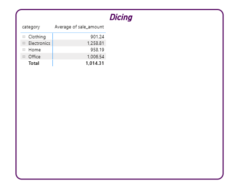
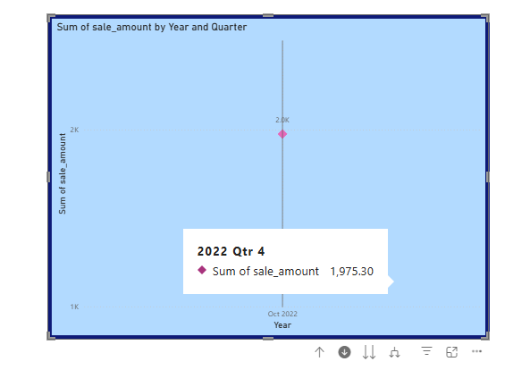
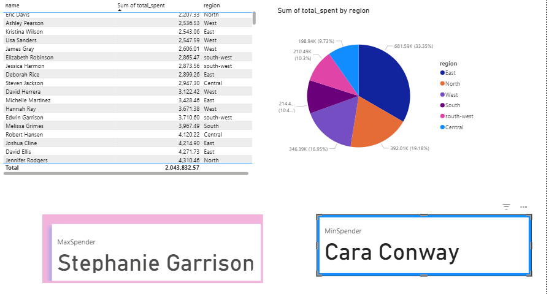
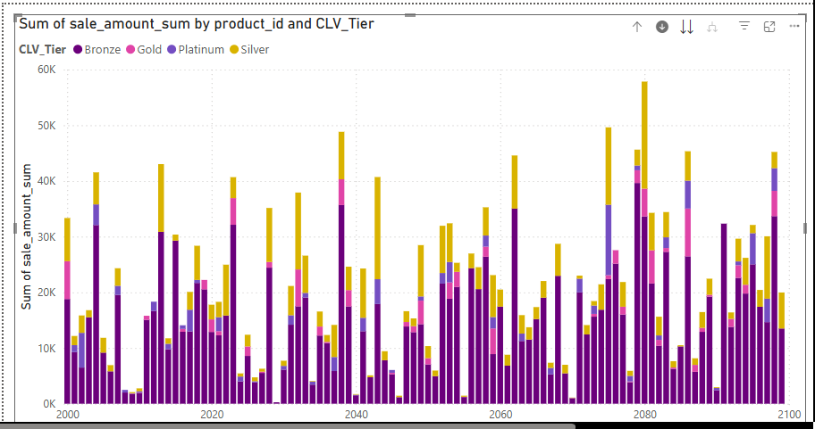

📊 Project P2: BI Python – Reading Raw Data into pandas DataFrames
This module verifies the initial setup of Business Intelligence (BI) Python project by reading raw CSV files into pandas DataFrames and logging the process.
📁 Directory Structure
analytics_project/
├── data/
│   └── raw/
│       ├── customers_data.csv
│       ├── products_data.csv
│       └── sales_data.csv
├── src/
│   └── analytics_project/
│       └── data_prep.py
├── utils_logger.py
└── README.md


🧠 What This Script Does
- Initializes a project-wide logger via utils_logger.py
- Defines reusable paths to the raw data directory from utils_logger.
- Reads three CSV files:
- customers_data.csv
- products_data.csv
- sales_data.csv
- Logs:
- Start and success of each file read
- File name and DataFrame preview
- Shape of each DataFrame
- Errors if files are missing or unreadable
🚀 How to Run
Ensure your working directory is set to the project root and the data/raw/ folder contains the required CSV files.
cd C:\Repos\smart-store-rucu\smart-store-rucu\src\analytics_project
py data_prep.py


🛠️ Requirements
- Python 3.8+
- pandas
- pathlib (standard library)
Install dependencies:
pip install pandas


🧾 Logging
Logging is handled via utils_logger.py, which provides consistent formatting and centralized control across modules.
📌 Notes
- If any CSV file is missing or unreadable, the script logs the error and continues without crashing.
- This module is designed for setup verification and can be extended for further data cleaning or transformation.
👤 Author
- Your Rucmanidevi Sethu
- Created for Project P2: BI Python – Reading Raw Data into pandas DataFrames


## WORKFLOW 1. Set Up Your Machine

Proper setup is critical.
Complete each step in the following guide and verify carefully.

- [SET UP MACHINE](./SET_UP_MACHINE.md)

---

## WORKFLOW 2. Set Up Your Project

After verifying your machine is set up, set up a new Python project by copying this template.
Complete each step in the following guide.

- [SET UP PROJECT](./SET_UP_PROJECT.md)

It includes the critical commands to set up your local environment (and activate it):

```shell
uv venv
uv python pin 3.12
uv sync --extra dev --extra docs --upgrade
uv run pre-commit install
uv run python --version
```


## WORKFLOW 3.

Git Pull from GitHub
```shell
git pull
```

###  Run Checks as You Work


```shell
uv sync --extra dev --extra docs --upgrade
uv cache clean
git add .
uvx ruff check --fix
uvx pre-commit autoupdate
uv run pre-commit run --all-files
git add .
uv run pytest
```


###  Execute

In VS Code terminal, run:

```shell
uv run python -m analytics_project.data_prep
```

You should see:

- Log messages in the terminal
- Data files loaded and read
- DataFrame sizes

If this works, your project is ready! If not, check:

- Are you in the right folder? (All terminal commands are to be run from the root project folder.)
- Did you run the full `uv sync --extra dev --extra docs --upgrade` command?
- Are there any error messages? (ask for help with the exact error)

---

###  Git add-commit-push to GitHub

Anytime we make working changes to code is a good time to git add-commit-push to GitHub.

1. Stage your changes with git add.
2. Commit your changes with a useful message in quotes.
3. Push your work to GitHub.

```shell
git add .
git commit -m "describe your change in quotes"
git push -u origin main
```

This will trigger the GitHub Actions workflow and publish your documentation via GitHub Pages.

### Project Commands

To run Python script

```shell
uv run python -m analytics_project.demo_module_basics
```

To run Jupyter Notebook

```shell
uv run jupyter lab
```

To run prepare_customers_data.py

```shell
python3 src/analytics_project/data_preparation/prepare_customers_data.py
```

To run prepare_products_data.py

```shell
python3 src/analytics_project/data_preparation/prepare_products_data.py
```

To run prepare_sales_data.py

```shell
python3 src/analytics_project/data_preparation/prepare_sales_data.py
```

To run data_scrubber.py

```shell
python3 src/analytics_project/data_scrubber.py
```
To run data_prep.py

```shell
python3 src/analytics_project/data_prep.py
```
To populate the data warehouse smart_sales.db
```shell
python3 src/analytics_project/data_prep etl_to_dw.py
```
### ETL Tables.

1. Customer - Dimension
2. Product - Dimension
3. Date - Dimension

Fact Table: Sales 


📊 Sales Analytics Dashboard — Power BI Project
🧠 Reporting tools allow us to turn warehouse data into actionable insights that drive business decisions. Since BI professionals work across multiple platforms, this project ensures that everyone gains equivalent experience, regardless of operating system.

Windows users will work with Power BI Desktop.
Mac/Linux users will implement the same concepts using Spark SQL and Python.
We will apply core OLAP operations (slicing, dicing, and drilldown) and generate interactive visualizations to explore business performance. This project reinforces key data analysis and reporting skills used across industries.

Environment:

OS | Windows11
BI Tool | Microsoft POwer BI Desktop
Data Source | ODBC Connection to relational database QLite_x64
Query Language | SQL via ODBC.Query
Visualisation Techniques| Slicer, Matrix,LineChart with Drill down

SQL QUeries Used

Total Spend by Customer
SELECT c.name, SUM(s.sale_amount) AS total_spent
FROM sales s
JOIN customer c ON s.customer_id = c.customer_id
GROUP BY c.name
ORDER BY total_spent DESC;


Sales by Category and Product
SELECT category, product_name, SUM(sale_amount) AS total_sales
FROM product_sales
GROUP BY category, product_name;


📁 Dataset Used
Table: product_sales
Fields included: | Field Name     | Description                                  | |----------------|----------------------------------------------| | category     | Product category (e.g., Electronics, Apparel)| | customer_id  | Unique customer identifier                   | | product_id   | Unique product identifier                    | | product_name | Name of the product                          | | sale_date    | Date of sale (used for time-based analysis)  | | sale_amount  | Total amount spent per transaction           |

Table: Top Customer
Fields included: |Name|Region|Total_Spent


🔍 Key Features
1. Slicing
- Date Range Slicer using sale_date
- Allows users to filter all visuals by custom time periods
- Supports “Between” and “Relative Date” modes for flexible analysis


2. Dicing
- Matrix and stacked column visuals group data by:
- category × product_name
- category × customer_id
- Enables comparison across multiple categorical dimensions


3. Drilldown
- Line chart with hierarchy: Year > Quarter > Month
- Users can click to drill into time-based trends
- Powered by Power BI’s built-in date hierarchy from sale_date



4. Max Spender Highlight
- Identifies top spender (e.g., Stephanie Garrison)
- Uses conditional formatting to bold or highlight “MaxSpender” label
5. Min Spender Highlight
   - Identifies lowest spender (e.g., Cara Conway)
   - Uses conditional formatting to bold or highlight “MinSpender” label
- 

🛠️ Setup Instructions
- Connect to Data Source
- Use ODBC or SQL connector to link to the original sales database
- Ensure DSN (e.g., SQLite_x64) is correctly configured
- Import Data
- Load product_sales table into Power BI
- If overwritten, re-import using Get Data → ODBC → select table
- Build Visuals
- Add slicers, matrix, and line charts as described above
- Use sale_amount as the aggregated value (Sum)
- Enable Drilldown
- Use Power BI’s date hierarchy
- Activate drill mode via the visual’s top-left drill icons

📈 Sample Insights
- Seasonal spikes in sales by category
- Top-performing products per quarter
- Customer spending patterns over time
- Identification of high-value customers

📌 Notes
- All visuals are dynamic and respond to slicer filters
- Dashboard is optimized for clarity, interactivity, and presentation impact
- Future enhancements may include:
- Predictive trend lines
- Exportable summary reports

👤 Author
Rucmani


Project 6: OLAP Cube Analysis
Section 1: The Business Goal
How does the CLV_Tier(Customer_LifetimeValue_Tier ) influence purchasing behaviour across weekdays and product categories?
Section 2: Data Source
Pre-cleaned OLAP cube outputs from the smart_sales_db and created two csv file(HV_customer_olap_cube.csv) with customer_id, name, CustomerLifetime Value fields and multidimensional_olap_cube.csv
with customer_id, DayofWeek, product_id, product_name, sale_amount_sum, sale_amount_mean, sale_id_count, category fields.
Joined both the csv files on customer_id.
Section 3:Tools
I used VS code to clean up existing data and used POwer BI for slicing, dicing, drilling down data for visual storytelling.
Section 4: Workflow and Logic
Dimensions: - CLV_Tier: Platinum, Gold, Silver, Bronze (based on CustomerLifetimeValue thresholds)
- DayofWeek: Extracted from sale_date, sorted using DayofWeekSort
- product_id, category
Aggregations:
- sale_amount_sum: Total sales per customer-product-day
- sale_amount_mean: Average sale value
- sales_id_count: Number of transactions
Power BI workflows:
1. Created a Stacked column chart to analyze the sum of sales amount by CLV Tier and Product id

2. Created a Matrix to identify the sum of Sales by week and CLV_Tier. I also used a drill down hierarchy (DayofWeek->product_id->category) Created a Heatmap to identify which Tier had the largest sum of sales amount.
3. Additionaly added SLicers to group the results by Category

Section 5: 

Narrative insights:
- Bronze-tier customers dominate Sunday sales, contributing over $1.4M
- Platinum and Gold tiers show concentrated activity on weekends
- Weekday purchases are sparse, suggesting opportunity for weekday incentives
Visuals:
- Matrix heat map showing tier-day performance
- Stacked column chart with drill-down into product/category
- Slicers enabling dynamic exploration

Section 6: Suggested Business Action
- Launch targeted Sunday promotions for Bronze-tier customers
- Introduce weekday loyalty incentives for high-value tiers
- Optimize inventory for top-selling categories on weekends
- Launch offers to increase sales on weekdays

Section 7: Challenges

- When merging the two csv files there were duplicate customer_id values in HV_customer_olap_cube which blocked the relationship modeling.
→ Resolved by removing duplicate rows in Power BI.
- The DayofWeek field was missing in Power BI despite being present in CSV
→ So I refreshed data source.


s